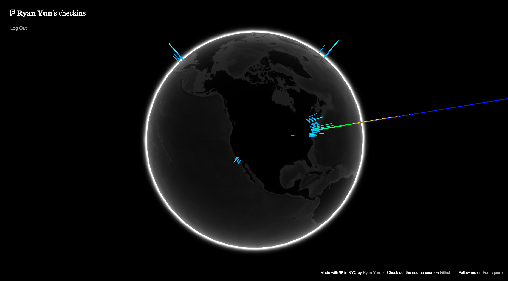

# Foursphere

## Description

Foursphere allows users to visualize their checkins with an interactive globe. This RoR application utilizes [Foursquare's API](https://developer.foursquare.com/) to access checkin data & implements Google Data Arts Team's [WebGL Globe](https://github.com/dataarts/webgl-globe/) (powered by [three.js](http://threejs.org/)) to create an interactive globe.

## Screenshots

## Background

I'm a die-hard [Foursquare](https://foursquare.com/) user & I love data visualization. Why not have the best of both worlds?

## Features

+ Omniauth to securely log in via Foursquare
+ Beautiful, interactive globe powered by three.js

## Contribute

Please feel free to contribute to this project.

## License

Foursphere is MIT Licensed. See LICENSE for details.